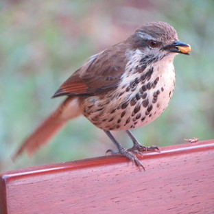
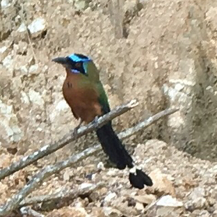

# Birds-to-Words

This repository contains the _Birds-to-Words_ dataset, a collection of paragraph-length descriptions of the differences between pairs of [iNaturalist](https://www.inaturalist.org) bird photographs.

The Birds-to-Words dataset was introduced in the paper:

**Neural Naturalist: Generating Fine-Grained Image Comparisons** 
[Maxwell Forbes](http://maxwellforbes.com/), [Christine Käser-Chen](https://twitter.com/kaeserchen), [Piyush Sharma](https://ai.google/research/people/PiyushSharma), [Serge Belongie](http://blogs.cornell.edu/techfaculty/serge-belongie/) 
_EMNLP 2019_

The data is provided in the file `birds-to-words-v1.0.tsv` in this repository.

## Sample

| Animal 1 | Animal 2 |
|  -   |  -   |
|    _photo: [John Ratzlaff (CC BY-NC-ND 4.0)](https://www.inaturalist.org/photos/647514)_ |    _photo: [Jessica (CC BY-NC 4.0)](https://www.inaturalist.org/photos/5595152)_  |

**Comparative Descriptions (four different writers):** 

1. Animal 1 is brown and white with a squatty body with a light brown head. Animal 2 is multi-colored with a light blue and black head.

2. Animal 1 has a brown head and wings, with a pale breast. The breast also has darker brown speckles on it. Animal 2 has a bright blue area around its eye, with a black patch right along the eye. Animal 2 also has a darker brown breast and greenish wings and back of its head.

3. Animal 1 has a brown and white face, animal 2 has a black and bright blue face. Animal 1 has a white breast with black spots, animal 2 has a brown breast. Animal 1 has brown wings, animal 2 has green wings.

4. Animal 1 is much smaller and shorter. Animal 2 has a larger head and longer tail feathers. Animal 1 has extensive spotting on the neck, chest, and belly. Animal 2 has turquoise head patches and brown coloring on the chest and belly.

## Data Format

The `tsv` file is tab-separated and contains the following eleven columns:

| Column | Name                 | Type   | Description                                                                                                                                                                                                |
|--------|----------------------|--------|------------------------------------------------------------------------------------------------------------------------------------------------------------------------------------------------------------|
| 1      | `img1ObservationURL` | string | URL of the iNaturalist photo record (including metadata) corresponding to the _left_ image in the pair                                                                                                     |
| 2      | `img1ImgURL`         | string | URL of the _left_ image itself                                                                                                                                                                             |
| 3      | `img1Species`        | string | Scientific species name for the animal in the _left_ image                                                                                                                                                 |
| 4      | `img1Selection`      | string |  How the _left_ image was selected in the "pivot-branch" stratified sampling procedure described in the paper. Value is one of: `{base, visual, sameSpecies, sameGenus, sameFamily, sameOrder, sameClass}` |
| 5      | `img2ObservationURL` | string | URL of the iNaturalist photo record (including metadata) corresponding to the _right_ image in the pair                                                                                                    |
| 6      | `img2ImgURL`         | string | URL of the _right_ image itself                                                                                                                                                                            |
| 7      | `img2Species`        | string | Scientific species name for the animal in the _right_ image                                                                                                                                                |
| 8      | `img2Selection`      | string | How the _right_ image was selected in the "pivot-branch" stratified sampling procedure described in the paper. Value is one of: `{base, visual, sameSpecies, sameGenus, sameFamily, sameOrder, sameClass}` |
| 9      | `split`              | string | Split for training models and reporting results. One of: `{train, val, test}`                                                                                                                              |
| 10     | `annN`               | int    | We collect up to five annotations of each image pair. This is the annotation number of this instance. Value is one of: `{1,2,3,4,5}`                                                                                  |
| 11     | `description`        | string | A natural language paragraph describing the differences between the animals in the two photographs                                                                                                         |

## License

The Birds-to-Words dataset is released under the [Creative Commons Attribution-ShareAlike 4.0 International License](https://creativecommons.org/licenses/by-sa/4.0/). For the full license, see `LICENSE.txt`.
